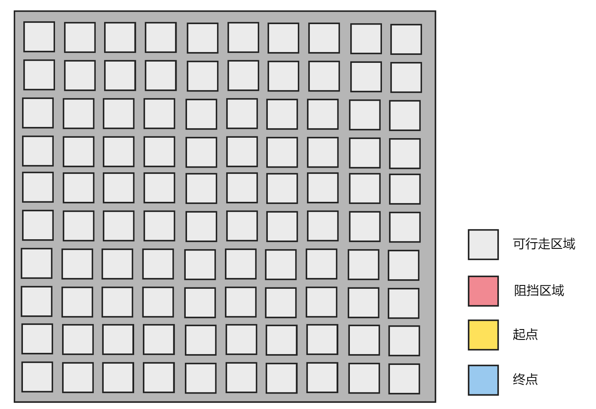
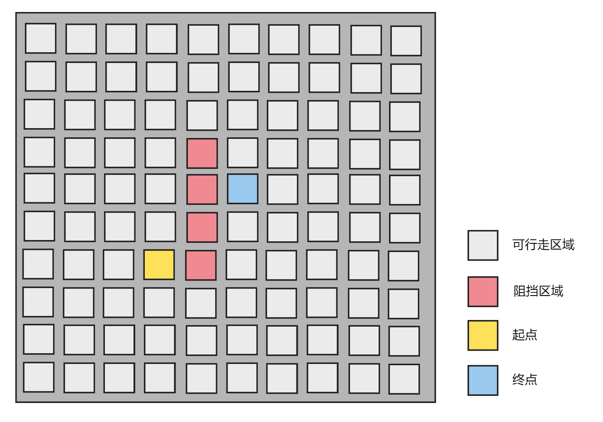
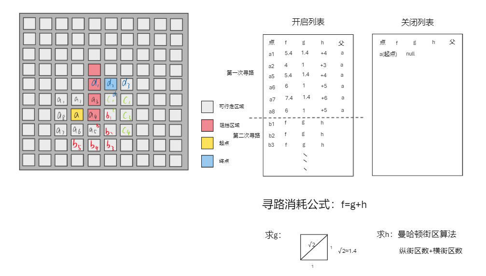
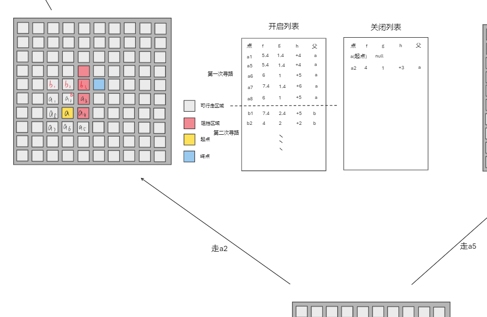
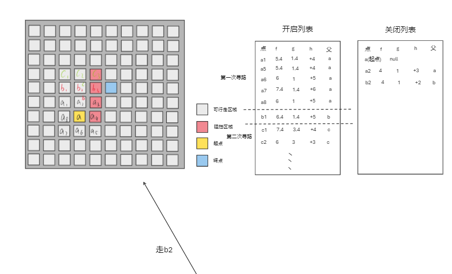
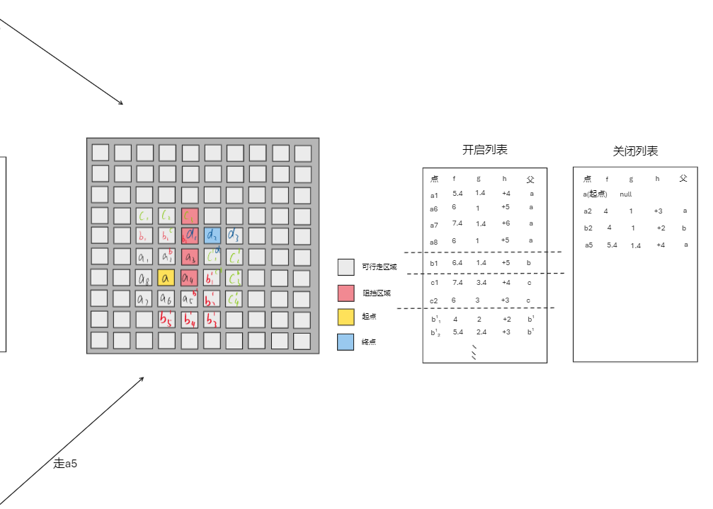
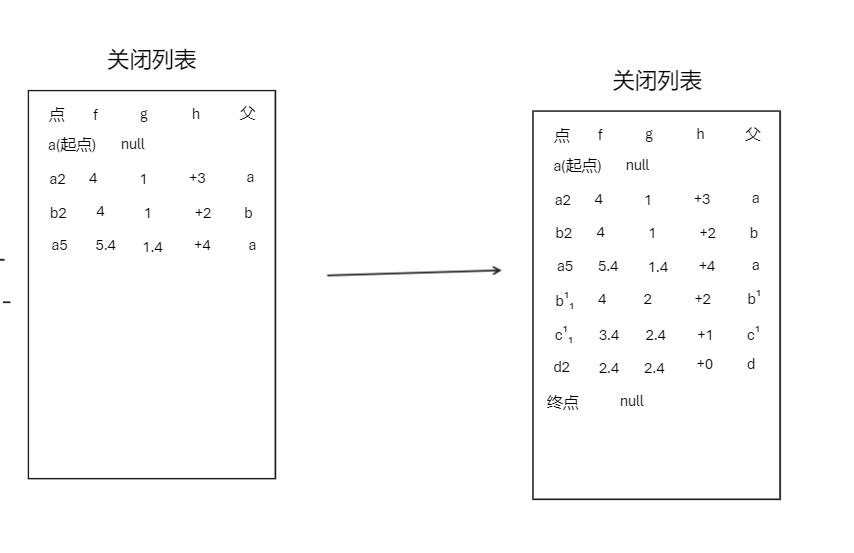
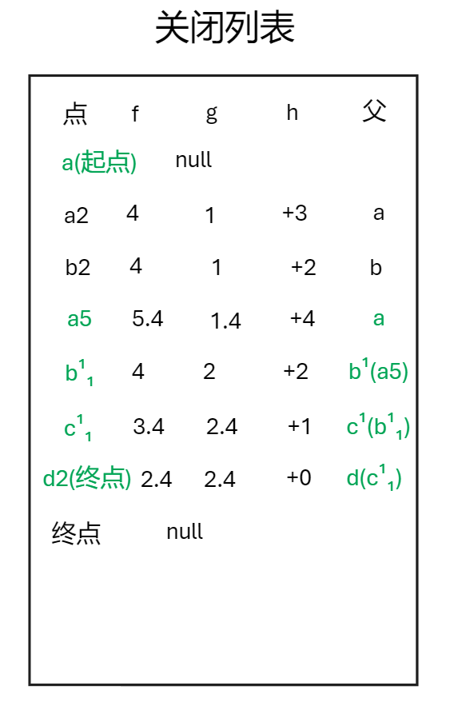

# A星寻路算法学习Demo

视频教程：[哔哩哔哩_bilibili_唐老师](https://www.bilibili.com/video/BV147411u7r5?p=1&vd_source=c096fc8249c2b2df286ca42785f0fa95)

## 理论讲解

先创建一个格子区域

填入起点、终点、阻挡区域

### 先来探讨一下原理

1. 干什么的？

   主要是用于游戏中角色进行寻路，可以计算出从当前位置到指定位置的最短路径。在 Unity中主要使用在2D场景，3D场景可以使用用NevMesh进行寻路

2. 基本原理

   - 不停的找自身周围的点，找到最佳的点后将其替代为起点继续重复之前的操作
   - 寻路消耗公式：`f(寻路消耗)=g(离起点的距离)+h(离终点的距离)`
   - 开启列表
   - 关闭列表
   - 格子对象的父对象

   

### 分步骤讨论

一、先把扩散图绘制出来

这里根据表中的f大小进行判断，得到a2为最小，按道理应该选择a2，但是最后却选择了a5，这就得分情况讨论。程序会优先走到a2，然后继续后面的遍历。。

二、判断最短路径——分情况讨论

走a2：

继续走b2：

三、情况不对，返回找最优解

这时候会发现在开启列表中，a5的f值最小，所以程序会回来重新走a5：

每次从新的点往周围找点时候，需要判断是否该格子可走，不可走的格子（边界、阻挡区域、已经添加区域）就都不需要添加到开启列表中

最终走完后关闭列表为：

关闭列表：

每次将最优点放入关闭列表中时，都需要判断该点是否为终点

这时候根据父节点往回推即可连成最短路径：

## 代码实现

